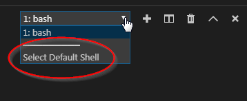
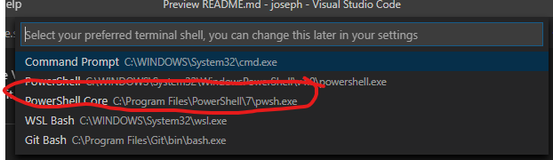
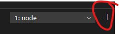

# [**Okikio**](https://okikio.netlify.app/)

[Getting started](#getting-started) | [Documentation](#documentation) | [Demos and examples](#demos-and-examples) | [Browser support](#browser-support)


## Getting started

### *Prerequisites*
* Github Account (go to [github](github.com) to create an account)
* Website Repository (I should have already provided you with this)

If you would rather not do all of this, you can leave it to me to design and post your website.

---

### *Edit Online*
Click **Open in Gitpod** and sign in with your Github account to edit online. Everything you need to start editing are ready for you. If you use this option ***skip*** the download section and go straight to [editing](#editing) portion of the **Usage** section, of **Getting Started**.

[](https://gitpod.io/#https://github.com/okikio/okikio)

---

### **Download**

### *Install Node.js*
Node.js is a JavaScript runtime built on Chrome's V8 JavaScript engine. For more information on using Node.js, see the [Node.js Website](https://nodejs.org/en/about/).

- *On Windows* <br> To install node on Windows go here: <a href="https://blog.teamtreehouse.com/install-node-js-npm-windows">https://blog.teamtreehouse.com/install-node-js-npm-windows</a>

- *On Mac OS* <br> To install node on Mac OS go here: <a href="https://blog.teamtreehouse.com/install-node-js-npm-mac">https://blog.teamtreehouse.com/install-node-js-npm-mac</a>

- *On Linux* <br> To install node on Linux go here: <a href="https://blog.teamtreehouse.com/install-node-js-npm-linux">https://blog.teamtreehouse.com/install-node-js-npm-linux</a>


### *Install Yarn*

Yarn is a fast, reliable, and secure dependency manager. Node.js automatically comes with one, it called npm ([Node Package Manager](https://www.npmjs.com/)) but I prefer yarn for it's speed and ease of use, for more information about [yarn](https://yarnpkg.com/en/). To install yarn you can go to it's site or install it using **npm** (ironically, using a package manager to install a package manager).

The command on all major OS's (Operating Systems) is the same, open your command prompt of choice and type this command:
```powershell
npm install yarn -g
```

or manual [download](https://yarnpkg.com/en/docs/install#windows-stable).


### *Install Git*

Git is a free and open source distributed version control system designed to handle everything from small to very large projects with speed and efficiency. Git is what allows you to publish your website online to be viewed, and also what allows you to rollback to a previous version if an error occurs. To install **git** you go to it's [site](https://git-scm.com/), you should see a download button for your operating system, click it and install git, for more information about [Git](https://git-scm.com/about).

Once git is installed you need to login to work on the website, so open your command prompt of choice and type:
```powershell
git config --global user.name "Your name here"
git config --global user.email "your_email@example.com"
```
(remember to replace the values in `"quotes"` with your [Github](github.com) account info)


### *Install Visual Studio Code*
In order to edit your website you need a code editor, I suggest VS Code (Visual Studio Code). VS Code is what I used in the creation of this project, and what will make the process of editing your website easy. To install VS Code go [here](https://code.visualstudio.com/). It has everything required for easy use built-in.

---

### **Usage**

Open the command prompt. In the command prompt type the command **git clone `url`**, this will download the website from online, note this may take a couple seconds to a few minutes depending on the speed of your internet connection and the performance of your computer. The `url` can be determined by going to the repository url link I will give you. When typed into your command prompt it should look like this:
```powershell
git clone https://github.com/okikio/okikio.git
```
(remember to replace the url with your repository info)

### *Launch*

This part is only necessary if this is the first time setup you are doing for your computer. If this isn't the first time setup skip to the [start](#start) section.

Once the repository has been cloned, open VS Code, once VS Code has been opened click the `File` tab at the very top of the VS Code window, then click the **Open Folder** option, when this is clicked a folder selection window should appear, in there you select the folder that was cloned from the **git** command; select the folder and it should appear on VS Code. In the top left tabs your should see the `Terminal` tab, click on it and select the **New Terminal** option, this will function as your command prompt.

If you are not using **Gitpod** to edit your website do this.

First install Powershell 7, this will teach you how to install it [https://www.howtogeek.com/663684/how-to-install-powershell-7-on-windows-10/](https://www.howtogeek.com/663684/how-to-install-powershell-7-on-windows-10/).

Then go back to VS Code (Visual Studio Code). Once VS Code opens go to the terminal tab. It should give you a set of icons and a dropdown menu near the middle right, click on the dropdown, it should give you the option to `Select Default Shell`,



 select that option, another popup should appear stating all the command prompts available, select `Powershell Core`.



Then click the plus icon in the bottom panel,



<h3 style="font-style: italic;" id="start">Start</h4>

In the command prompt type the command **yarn**, this will start installing the packages required for the website, note this may take a couple seconds to a few minutes depending on the speed of your internet connection and the performance of your computer.
```powershell
yarn
```


Once **yarn** is done you should be able to now start editing your site, but first to see how your site looks, type into the command prompt:
```powershell
yarn watch
```

## **Documentation**

### *Commands*
There are a total of 3 different commands.
```powershell
yarn watch
yarn develop
yarn build
```


Each command has their use case and their reasons for existing, the most important command is
```powershell
yarn watch
```

It runs the website on the browser and automatically updates as you tweak the websites code. On some OS's it automatically opens it up in the default browser, but if it doesn't just type [http://localhost:3000](http://localhost:3000) into a browser.

<br>

The other 2 commands are for debugging errors, and for testing purposes.
```powershell
yarn develop
```
is for debugging, if an error occurs, it does the same thing,

```powershell
yarn watch
```
does, it treats the code like you are currently in developement, so you can change code and it will automatically reload the browser.

<br>

On the other hand
```powershell
yarn build
```
is meant for testing, testing how the website will react if it were published to the web, it won't be used often.

---

### *Editing*
You will most likely only change some text and an image here and there. To add new pages and edit old ones you need to navigate to views/pages for example if you want to edit the homepage you have to edit the [index.pug](./views/pages/index.pug) file. Right click on *pages* folder in the *views* folder, click create a new file, make sure it ends in `.pug`. You can call it whatever you want (Note: the name of the file is the name you use to access it, for example, `blog-for-october.pug` will be accessed using this `[website-domain.com]/blog-for-october`. You can also create folders, `2020/cool-things.pug` => `[website-domain.com]/2020/cool-things`). Once you have created your new webpage copy this to it,
```pug
extends /app.pug

block pageInfo
  -
    let page = {
      //- Put page url here
      url: "/my-projects",

      //- Put page name here
      name: "my-projects",

      //- Put page title here
      title: "A showcase of some of the projects I have taken on.",

      //- Put short description here
      description: "A potfolio of projects I have completed, and even some that are still on-going..."
    };

block content
  //- Hero layer / Banner layer
  +hero({
    title: "Title of hero",
    content: "Description over here...",
    image: {
      //- Don't cha
      class: "effect-parallax hero-img",
      src: "cloudinary/closeup-stones",
      alt: "A city Image"
    }
  })

  //- Intro layer
  +layer({
    class: "layout-padding-horz-default--device-gt-tablet layout-padding-vert-top-default--device-phone"
  })
    +layout({
      class: "layout-shorten layout-contain"
    })
      +head("About me")
      +main({
        class: "layout-padding-top-large"
      })
        +row({
          class: "layout-margin-horz-dull"
        })
          //- 1st Column
          +column({
            class: "layout-col-2 layout-padding-horz-dull layout-padding-bottom-small"
          })
            +p({
              content: "03/03",
              class: "style-font-17--device-phone style-font-20 style-bold"
            })

          //- 2nd Column
          +column({
            class: "layout-col-3 layout-padding-horz-dull layout-padding-bottom"
          })
            +p({
              content: "2018",
              class: "layout-block style-font-17--device-phone style-font-20 style-bold"
            })
            +p({
              content: "E-commerse",
              class: "layout-block style-font-16--device-phone style-font-18"
            })
            +p({
              content: "Design Executive",
              class: "layout-block style-font-16--device-phone style-font-18"
            })

          //- 3rd Column
          +column({
            class: "layout-col-7 layout-padding-horz-dull"
          })
            p.layout-margin-dull(lorem="1")

        section.layout-padding-top.layout-padding-bottom-large
          //- span.layout-margin-horz-left.layout-inline-block= " "
          +p("One of my life goals is to leave everything I come in contact with better than I found it. This obviously can be difficult, but a couple of the ways I am trying to achieve this is to seize every opportunity and learn from previous mistakes... For more info")
          +link({
            href: "/about-me",
            class: "layout-margin-vert-dull layout-margin-left-mini",
            content: "click here."
          })

  //- Banner layer
  +layer({
    class: "layer-color-primary"
  })
    +layout({
      class: "layout-contain-large layout"
    })
      +head({
        class: "style-center"
      })
        h3.layout-padding-vert.style-bold-font.style-600.style-color-white.style-font-40--device-lt-tablet.style-font-size-larger--device-gt-phone Projects
          span.style-color-tertiary-dark .

  //- Breakthrough layer
  +layer
    +layout({
      class: "layout-contain-large layout-padding-large"
    })
      +main({
        class: "layout-padding-vert"
      })
        +row
          //- 1st Column
          +column({
            class: "layout-col-6 layout-padding-bottom-small layout-padding-right-large"
          })
            +p({
              content: "Breakthrough<br>Limits!",
              class: "style-color-primary style-bold-font style-600 style-font-30 style-line-height"
            })

          //- 2nd Column
          +column({
            class: "layout-col-6"
          })
            p.layout-block.layout-margin-dull(lorem="1")

  //- Image Column layer
  +layer
    +layout({
      class: "layout-contain-large"
    })
      +main({
        class: "layout-shorten-vert"
      })
        //- 1st Row
        +row({
          class: "layout-margin-dull"
        })
          //- Empty alignment Column
          +column({
            class: "layout-col-3 layout-block"
          })

          //- 1st Column
          +column({
            class: "layout-col-9 layout-padding-small"
          })
            +link({
              href: "/about-me",
              class: "layout-block"
            }, true)
              +tile({
                title: "Google Designs About",
                class: "layer-box layer-surface layout-block",
                image: {
                  class: "effect-parallax",
                  src: "cloudinary/city",
                  alt: "City Alt",
                }
              })

        //- 2nd Row
        +row({
          class: "layout-margin-dull"
        })
          //- 1st Column
          +column({
            class: "layout-col-9 layout-padding-small layout-padding-vert-large"
          })
            +link({
              href: "/my-projects",
              class: "layout-block"
            }, true)
              +tile({
                title: "Google Designs Project",
                class: "layer-box layer-surface layout-block",
                image: {
                  src: "cloudinary/blue-sky",
                  alt: "Blue sky Alt",
                }
              })

          //- Empty alignment Column
          +column({
            class: "layout-col-3"
          })
```
When you first open the file type the shortcuts to fold all code (to make code easy to read),
The beauty of Visual Studio Code is

<kbd>Ctrl</kbd> + <kbd>Shift</kbd> + <kbd>P</kbd>

Hit it and search anything you want.

In your case, hit <kbd>Ctrl</kbd> + <kbd>Shift</kbd> + <kbd>P</kbd> and type `Fold All`. Click on the `Fold All` option, everything should now make more sense.

Take it slow and gradual, I am still working on creating indept instructions for editing, and making complex style changes, but for now edit only text and maybe images.

Contact me if you have any issues.

## Browser support
A lot of them, I designed this website to support as many browsers as practical, I no longer support IE as the new Chromium Edge supports all the features of IE and modern stuff as well.
